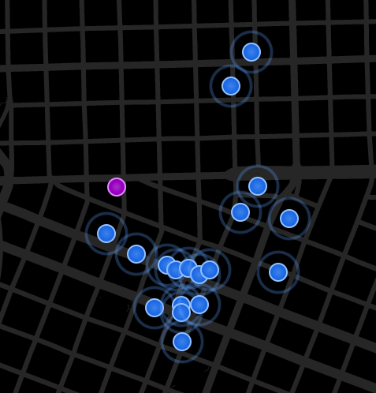
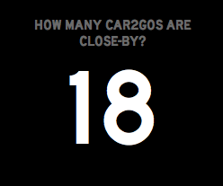

car2go panels for Status Board
==============================

* `/`: a styled map showing the location of car2go vehicles near the Panic office



* `/count.`: the number of car2go vehicles near the Panic office



Installation
------------

You'll need to install the [Proj4](https://trac.osgeo.org/proj/) library before installing the required gems. It's available via Homebrew as "proj"

```
$ [sudo] bundle install
```
